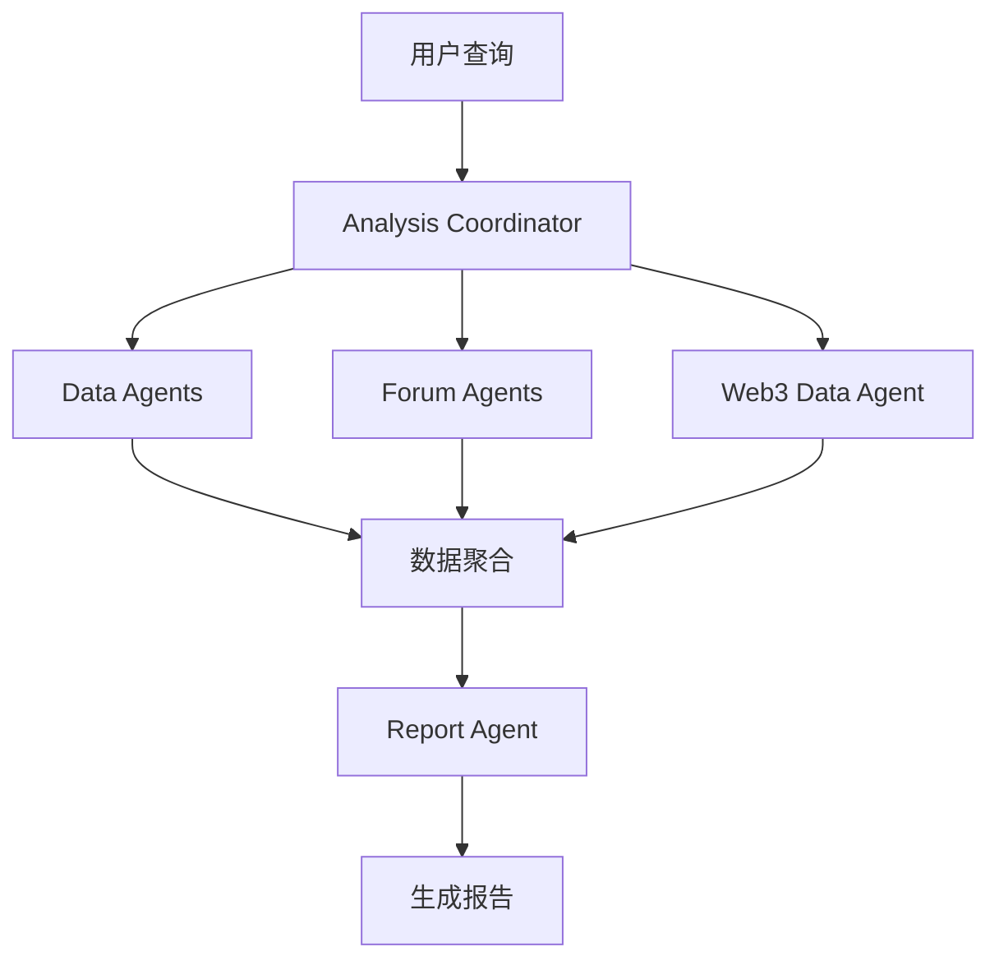

<div align="center">

# 🔍 CryptoWatch


<p><strong>基于 LangGraph 的加密货币市场多智能体舆情分析系统</strong></p>

[](https://github.com/hanxiao199001/CryptoWatch/stargazers)
[](https://github.com/hanxiao199001/CryptoWatch/network)
[](https://github.com/hanxiao199001/CryptoWatch/issues)
[](LICENSE)

[](https://www.python.org)
[](https://github.com/langchain-ai/langgraph)
[](https://www.deepseek.com)

<p>灵感来源于 <a href="https://github.com/666ghj/BettaFish">BettaFish</a> | 专注于 Web3 领域的实时舆情分析</p>

</div>

---

## 📑 目录

- [核心特性](#-核心特性)
- [系统架构](#-系统架构)
- [快速开始](#-快速开始)
- [文档中心](#-文档中心)
- [智能体系统](#-智能体系统)
- [技术栈](#-技术栈)
- [使用示例](#-使用示例)
- [参与贡献](#-参与贡献)
- [开发路线图](#-开发路线图)
- [常见问题](#-常见问题-faq)
- [许可证](#-许可证)

---

## ✨ 核心特性

<table>
<tr>
<td width="50%" valign="top">

### 🤖 多智能体协作
基于 **LangGraph** 的智能体编排架构
- 协同工作流
- 智能任务分配
- 实时数据同步

</td>
<td width="50%" valign="top">

### ⛓️ Web3 数据集成
支持主流区块链数据源
- CoinGecko API
- Etherscan
- 实时链上数据

</td>
</tr>
<tr>
<td width="50%" valign="top">

### 📊 实时舆情分析
自动化情感分析与趋势预测
- 社交媒体监控
- 社区情绪分析
- 智能预警系统

</td>
<td width="50%" valign="top">

### 🧠 AI 驱动
集成先进大语言模型
- DeepSeek 推理
- Kimi 长文本处理
- 多模型协同

</td>
</tr>
</table>

## 🏗️ 系统架构


<details>
<summary>📁 项目结构（点击展开）</summary>

```
CryptoWatch/
├── 📊 analysis_coordinator.py   # 分析协调器
├── 📡 data_agents.py            # 数据采集智能体
├── 💬 forum_agents.py           # 论坛分析智能体
├── 📝 report_agent.py           # 报告生成智能体
├── ⛓️  web3_data_agent.py       # Web3数据智能体
├── 🚀 bettafish_mini.py         # 主程序入口
├── 📚 docs/                     # 项目文档
│   ├── ARCHITECTURE.md         # 架构说明
│   ├── USER_GUIDE.md           # 用户指南
│   ├── PROJECT_SUMMARY.md      # 项目总结
│   └── installation.md         # 安装指南
├── 🧪 tests/                    # 测试文件
├── 🔧 .github/                  # GitHub配置
│   ├── workflows/              # CI/CD工作流
│   └── ISSUE_TEMPLATE/         # Issue模板
├── 📦 requirements.txt          # 依赖清单
├── 🔐 .env.example              # 环境变量示例
└── 📄 CONTRIBUTING.md           # 贡献指南
```

</details>

## 🚀 快速开始

### ⚡ 三步开始使用

```bash
# 1. 克隆并进入项目
git clone https://github.com/hanxiao199001/CryptoWatch.git && cd CryptoWatch

# 2. 安装依赖
pip install -r requirements.txt

# 3. 配置 API 密钥并运行
cp .env.example .env
# 编辑 .env 填入你的 API 密钥
python bettafish_mini.py
```

> 💡 **首次使用提示**: 你需要至少一个 LLM API 密钥（DeepSeek 或 Kimi）才能运行系统。

### 📋 前置要求

| 要求 | 版本 | 说明 |
|------|------|------|
| 🐍 Python | 3.9+ | 推荐使用 3.9 或更高版本 |
| 🔑 API Keys | - | DeepSeek/Kimi API 密钥 |
| 💾 内存 | 2GB+ | 建议 4GB 以上 |

### ⚙️ 安装步骤

<details>
<summary>📖 详细安装说明（点击展开）</summary>
```bash
# 1️⃣ 克隆仓库
git clone https://github.com/hanxiao199001/CryptoWatch.git
cd CryptoWatch

# 2️⃣ 创建虚拟环境
python -m venv venv

# macOS/Linux
source venv/bin/activate

# Windows
venv\Scripts\activate

# 3️⃣ 安装依赖
pip install --upgrade pip
pip install -r requirements.txt

# 4️⃣ 配置环境变量
cp .env.example .env
# 使用你喜欢的编辑器编辑 .env
nano .env  # 或 vim .env 或 code .env

# 5️⃣ 运行主程序
python bettafish_mini.py
```

</details>

### 🔑 环境配置

在 `.env` 文件中配置以下关键参数：
```env
# LLM API 配置（必需）
DEEPSEEK_API_KEY=your_deepseek_api_key
KIMI_API_KEY=your_kimi_api_key

# Web3 数据源（可选）
COINGECKO_API_KEY=your_coingecko_key
ETHERSCAN_API_KEY=your_etherscan_key
```

> 💡 **提示**:
> - 至少需要配置一个 LLM API 密钥（DeepSeek 或 Kimi）
> - Web3 数据源 API 密钥是可选的，用于增强数据采集能力

## 📖 文档中心

<table>
<tr>
<td align="center" width="25%">
<a href="docs/ARCHITECTURE.md">

<br/>
<strong>系统架构</strong>
</a>
</td>
<td align="center" width="25%">
<a href="docs/USER_GUIDE.md">

<br/>
<strong>用户指南</strong>
</a>
</td>
<td align="center" width="25%">
<a href="docs/PROJECT_SUMMARY.md">

<br/>
<strong>项目总结</strong>
</a>
</td>
<td align="center" width="25%">
<a href="docs/installation.md">

<br/>
<strong>安装指南</strong>
</a>
</td>
</tr>
</table>

## 🤖 智能体系统

### 核心智能体

<details>
<summary>📡 <strong>Data Agents</strong> - 数据采集智能体</summary>

**功能特性：**
- 💰 实时价格数据采集
- 📈 交易量统计分析
- 🐦 社交媒体动态监控
- 📰 新闻资讯聚合

**支持的数据源：**
- CoinGecko
- CoinMarketCap
- Twitter API
- Reddit API
- Discord

</details>

<details>
<summary>💬 <strong>Forum Agents</strong> - 论坛分析智能体</summary>

**功能特性：**
- 🔥 热点话题识别
- 😊 情感倾向分析
- 📊 社区活跃度评估
- 💡 观点提取汇总

**分析维度：**
- 正面/负面情绪比例
- 讨论热度趋势
- 关键意见领袖
- 话题演变轨迹

</details>

<details>
<summary>⛓️ <strong>Web3 Data Agent</strong> - 链上数据智能体</summary>

**功能特性：**
- 💸 交易数据实时分析
- 📜 智能合约活动监控
- 🏦 DeFi 协议追踪
- 🎨 NFT 市场动态

**支持的区块链：**
- Ethereum
- BSC
- Polygon
- Arbitrum

</details>

<details>
<summary>📝 <strong>Report Agent</strong> - 报告生成智能体</summary>

**功能特性：**
- 📊 数据可视化
- 📈 趋势预测分析
- 💡 投资建议生成
- ⚠️ 风险提示预警

**报告类型：**
- 日报
- 周报
- 专题分析
- 风险评估

</details>

## 🛠️ 技术栈

<div align="center">

### 核心框架


### AI 模型


### 数据存储


</div>

## 📊 使用示例

### 方式 1: 直接运行主程序

最简单的方式是直接运行主程序，它会执行预设的示例分析：

```bash
python bettafish_mini.py
```

这将运行三个示例：
- ✅ Ethereum 的完整分析
- ✅ Bitcoin 的快速市场检查
- ✅ 多个项目的对比分析

### 方式 2: Python 脚本调用

#### 完整分析
```python
from bettafish_mini import CryptoWatch

# 初始化系统
crypto_watch = CryptoWatch()

# 分析单个加密货币
result = crypto_watch.analyze(
    topic="Bitcoin",
    coin_id="bitcoin",
    save_report=True
)

# result 包含:
# - data: 收集的所有数据
# - analyses: 各专家的分析结果
# - report: 生成的完整报告
```

#### 快速市场检查
```python
# 快速检查价格和市场数据
price_data = crypto_watch.quick_market_check("ethereum")

# 输出: 当前价格、24h变化、市值、交易量等
```

#### 项目对比分析
```python
# 对比多个项目
results = crypto_watch.compare_projects([
    ("Bitcoin", "bitcoin"),
    ("Ethereum", "ethereum"),
    ("Solana", "solana"),
    ("BNB", "binancecoin")
])
```

## 🤝 参与贡献

<div align="center">

我们欢迎所有形式的贡献！🎉

[](https://github.com/hanxiao199001/CryptoWatch/graphs/contributors)

</div>

### 贡献方式

1. 🍴 **Fork** 本仓库
2. 🌿 **创建**特性分支 (`git checkout -b feature/AmazingFeature`)
3. 💾 **提交**更改 (`git commit -m 'Add some AmazingFeature'`)
4. 📤 **推送**到分支 (`git push origin feature/AmazingFeature`)
5. 🔀 **开启** Pull Request

详见 [贡献指南](CONTRIBUTING.md)

### 贡献者

<!-- ALL-CONTRIBUTORS-LIST:START -->
感谢这些优秀的贡献者！
<!-- ALL-CONTRIBUTORS-LIST:END -->

## 📝 开发路线图

### ✅ 已完成

- [x] 基础架构搭建
- [x] 多智能体系统实现
- [x] 数据采集模块
- [x] 情感分析功能
- [x] 报告生成系统

### 🚧 进行中

- [ ] Web UI 界面开发
- [ ] 实时预警系统
- [ ] 性能优化

### 📅 计划中

- [ ] 🐳 Docker 容器化部署
- [ ] 🔌 RESTful API 服务
- [ ] 📊 实时数据仪表板
- [ ] 📱 移动端适配
- [ ] 🌐 多语言支持
- [ ] 🔔 Telegram/Discord Bot

## 🙏 致谢

<table>
<tr>
<td align="center">
<strong>灵感来源</strong><br/>
<a href="https://github.com/666ghj/BettaFish">

</a>
</td>
<td align="center">
<strong>框架支持</strong><br/>

</td>
<td align="center">
<strong>AI 赋能</strong><br/>

</td>
</tr>
</table>

特别感谢 [@666ghj](https://github.com/666ghj) 创建的 BettaFish 项目！

## ❓ 常见问题 FAQ

<details>
<summary><strong>Q: 运行时提示 API 密钥错误怎么办？</strong></summary>

**A:** 请确保：
1. 已复制 `.env.example` 为 `.env`
2. 在 `.env` 文件中填入了有效的 API 密钥
3. API 密钥格式正确，没有多余的空格或引号

```env
# 正确示例
DEEPSEEK_API_KEY=sk-xxxxxxxxxxxxx

# 错误示例（不要添加引号）
DEEPSEEK_API_KEY="sk-xxxxxxxxxxxxx"
```
</details>

<details>
<summary><strong>Q: 支持哪些加密货币的分析？</strong></summary>

**A:** 支持 CoinGecko 上所有的加密货币。常用的 coin_id 包括：
- Bitcoin: `bitcoin`
- Ethereum: `ethereum`
- BNB: `binancecoin`
- Solana: `solana`
- Cardano: `cardano`

可以在 [CoinGecko](https://www.coingecko.com/) 上查找更多 coin_id。
</details>

<details>
<summary><strong>Q: 生成的报告保存在哪里？</strong></summary>

**A:** 报告默认保存在项目根目录的 `reports/` 文件夹中，文件名格式为 `{topic}_{timestamp}.md`。
</details>

<details>
<summary><strong>Q: 如何只获取价格数据而不进行完整分析？</strong></summary>

**A:** 使用 `quick_market_check()` 方法：
```python
crypto_watch = CryptoWatch()
crypto_watch.quick_market_check("bitcoin")
```
</details>

<details>
<summary><strong>Q: 系统需要联网吗？</strong></summary>

**A:** 是的，系统需要联网来：
- 调用 LLM API（DeepSeek/Kimi）
- 获取加密货币市场数据
- 搜索相关新闻和社交媒体信息
</details>

## 📄 许可证

本项目采用 [GPL-2.0](LICENSE) 许可证。
```
Copyright (C) 2025 hanxiao199001

This program is free software; you can redistribute it and/or modify
it under the terms of the GNU General Public License as published by
the Free Software Foundation; either version 2 of the License.
```

## 📮 联系方式

<div align="center">

### 保持联系

[](https://github.com/hanxiao199001)
[](mailto:han272624836@gmail.com)

</div>

---

<div align="center">

### ⭐ 如果这个项目对你有帮助，请给个 Star！

## 📈 Star History

[](https://star-history.com/#hanxiao199001/CryptoWatch&Date)

<br/>

**Made with ❤️ by [@hanxiao199001](https://github.com/hanxiao199001)**

*致力于打造最好的加密货币舆情分析工具*

</div>
