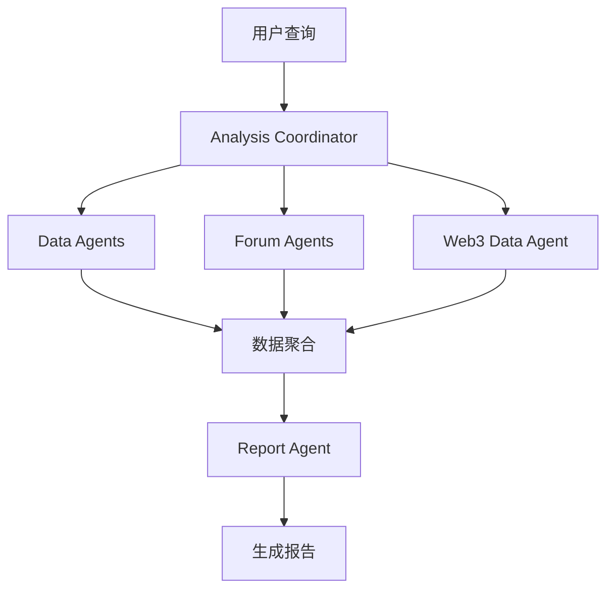

<div align="center">

# 🔍 CryptoWatch


<p><strong>基于 LangGraph 的加密货币市场多智能体舆情分析系统</strong></p>

[](https://github.com/hanxiao199001/CryptoWatch/stargazers)
[](https://github.com/hanxiao199001/CryptoWatch/network)
[](https://github.com/hanxiao199001/CryptoWatch/issues)
[](LICENSE)

[](https://www.python.org)
[](https://github.com/langchain-ai/langgraph)
[](https://www.deepseek.com)

<p>灵感来源于 <a href="https://github.com/666ghj/BettaFish">BettaFish</a> | 专注于 Web3 领域的实时舆情分析</p>

</div>

---

## ✨ 核心特性

<table>
<tr>
<td width="50%" valign="top">

### 🤖 多智能体协作
基于 **LangGraph** 的智能体编排架构
- 协同工作流
- 智能任务分配
- 实时数据同步

</td>
<td width="50%" valign="top">

### ⛓️ Web3 数据集成
支持主流区块链数据源
- CoinGecko API
- Etherscan
- 实时链上数据

</td>
</tr>
<tr>
<td width="50%" valign="top">

### 📊 实时舆情分析
自动化情感分析与趋势预测
- 社交媒体监控
- 社区情绪分析
- 智能预警系统

</td>
<td width="50%" valign="top">

### 🧠 AI 驱动
集成先进大语言模型
- DeepSeek 推理
- Kimi 长文本处理
- 多模型协同

</td>
</tr>
</table>

## 🏗️ 系统架构

```mermaid
graph TB
    A[用户查询] --> B[Analysis Coordinator]
    B --> C[Data Agents]
    B --> D[Forum Agents]
    B --> E[Web3 Data Agent]
    C --> F[数据聚合]
    D --> F
    E --> F
    F --> G[Report Agent]
    G --> H[生成报告]
```

<details>
<summary>📁 项目结构（点击展开）</summary>
```
CryptoWatch/
├── 📊 analysis_coordinator.py   # 分析协调器
├── 📡 data_agents.py            # 数据采集智能体
├── 💬 forum_agents.py           # 论坛分析智能体
├── 📝 report_agent.py           # 报告生成智能体
├── ⛓️  web3_data_agent.py        # Web3数据智能体
├── 🚀 bettafish_mini.py         # 主程序入口
├── 📚 docs/                     # 项目文档
│   ├── ARCHITECTURE.md       
│   ├── USER_GUIDE.md         
│   ├── PROJECT_SUMMARY.md    
│   └── installation.md       
├── 🧪 tests/                    # 测试文件
├── 🔧 .github/                  # GitHub配置
│   ├── workflows/            # CI/CD工作流
│   └── ISSUE_TEMPLATE/       # Issue模板
└── 📦 requirements.txt          # 依赖清单
```

</details>

## 🚀 快速开始

### 📋 前置要求

| 要求 | 版本 | 说明 |
|------|------|------|
| 🐍 Python | 3.11+ | 推荐使用 3.11 或更高版本 |
| 🐘 PostgreSQL | 15+ | 用于数据持久化 |
| 💾 内存 | 2GB+ | 建议 4GB 以上 |

### ⚙️ 安装步骤

<details>
<summary>📖 详细安装说明（点击展开）</summary>
```bash
# 1️⃣ 克隆仓库
git clone https://github.com/hanxiao199001/CryptoWatch.git
cd CryptoWatch

# 2️⃣ 创建虚拟环境
python -m venv venv

# macOS/Linux
source venv/bin/activate

# Windows
venv\Scripts\activate

# 3️⃣ 安装依赖
pip install --upgrade pip
pip install -r requirements.txt

# 4️⃣ 配置环境变量
cp .env.example .env
# 使用你喜欢的编辑器编辑 .env
nano .env  # 或 vim .env 或 code .env

# 5️⃣ 初始化数据库（如果需要）
# python scripts/init_db.py

# 6️⃣ 运行主程序
python bettafish_mini.py
```

</details>

### 🔑 环境配置

在 `.env` 文件中配置以下关键参数：
```env
# LLM API 配置
DEEPSEEK_API_KEY=your_deepseek_api_key
KIMI_API_KEY=your_kimi_api_key

# 数据库配置
DB_HOST=localhost
DB_PORT=5432
DB_NAME=cryptowatch
DB_USER=postgres
DB_PASSWORD=your_password

# Web3 数据源
COINGECKO_API_KEY=your_coingecko_key
ETHERSCAN_API_KEY=your_etherscan_key
```

## 📖 文档中心

<table>
<tr>
<td align="center" width="25%">
<a href="docs/ARCHITECTURE.md">

<br/>
<strong>系统架构</strong>
</a>
</td>
<td align="center" width="25%">
<a href="docs/USER_GUIDE.md">

<br/>
<strong>用户指南</strong>
</a>
</td>
<td align="center" width="25%">
<a href="docs/PROJECT_SUMMARY.md">

<br/>
<strong>项目总结</strong>
</a>
</td>
<td align="center" width="25%">
<a href="docs/installation.md">

<br/>
<strong>安装指南</strong>
</a>
</td>
</tr>
</table>

## 🤖 智能体系统

### 核心智能体

<details>
<summary>📡 <strong>Data Agents</strong> - 数据采集智能体</summary>

**功能特性：**
- 💰 实时价格数据采集
- 📈 交易量统计分析
- 🐦 社交媒体动态监控
- 📰 新闻资讯聚合

**支持的数据源：**
- CoinGecko
- CoinMarketCap
- Twitter API
- Reddit API
- Discord

</details>

<details>
<summary>💬 <strong>Forum Agents</strong> - 论坛分析智能体</summary>

**功能特性：**
- 🔥 热点话题识别
- 😊 情感倾向分析
- 📊 社区活跃度评估
- 💡 观点提取汇总

**分析维度：**
- 正面/负面情绪比例
- 讨论热度趋势
- 关键意见领袖
- 话题演变轨迹

</details>

<details>
<summary>⛓️ <strong>Web3 Data Agent</strong> - 链上数据智能体</summary>

**功能特性：**
- 💸 交易数据实时分析
- 📜 智能合约活动监控
- 🏦 DeFi 协议追踪
- 🎨 NFT 市场动态

**支持的区块链：**
- Ethereum
- BSC
- Polygon
- Arbitrum

</details>

<details>
<summary>📝 <strong>Report Agent</strong> - 报告生成智能体</summary>

**功能特性：**
- 📊 数据可视化
- 📈 趋势预测分析
- 💡 投资建议生成
- ⚠️ 风险提示预警

**报告类型：**
- 日报
- 周报
- 专题分析
- 风险评估

</details>

## 🛠️ 技术栈

<div align="center">

### 核心框架


### AI 模型


### 数据存储


</div>

## 📊 使用示例

### 基础分析
```python
from bettafish_mini import CryptoAnalyzer

# 初始化分析器
analyzer = CryptoAnalyzer()

# 分析单个加密货币
result = analyzer.analyze("Bitcoin")

# 输出结果
print(f"📊 情感得分: {result.sentiment_score:.2f}")
print(f"📈 趋势预测: {result.trend_prediction}")
print(f"💡 投资建议: {result.recommendation}")
print(f"⚠️  风险等级: {result.risk_level}")
```

### 批量分析
```python
# 分析多个加密货币
cryptocurrencies = ["Bitcoin", "Ethereum", "Solana"]

for crypto in cryptocurrencies:
    result = analyzer.analyze(crypto)
    print(f"\n{'='*50}")
    print(f"📌 {crypto}")
    print(f"{'='*50}")
    print(result.summary())
```

### 自定义配置
```python
from bettafish_mini import CryptoAnalyzer, Config

# 自定义配置
config = Config(
    llm_provider="deepseek",
    max_data_sources=10,
    sentiment_threshold=0.6,
    enable_real_time=True
)

analyzer = CryptoAnalyzer(config=config)
```

## 🤝 参与贡献

<div align="center">

我们欢迎所有形式的贡献！🎉

[](https://github.com/hanxiao199001/CryptoWatch/graphs/contributors)

</div>

### 贡献方式

1. 🍴 **Fork** 本仓库
2. 🌿 **创建**特性分支 (`git checkout -b feature/AmazingFeature`)
3. 💾 **提交**更改 (`git commit -m 'Add some AmazingFeature'`)
4. 📤 **推送**到分支 (`git push origin feature/AmazingFeature`)
5. 🔀 **开启** Pull Request

详见 [贡献指南](CONTRIBUTING.md)

### 贡献者

<!-- ALL-CONTRIBUTORS-LIST:START -->
感谢这些优秀的贡献者！
<!-- ALL-CONTRIBUTORS-LIST:END -->

## 📝 开发路线图

### ✅ 已完成

- [x] 基础架构搭建
- [x] 多智能体系统实现
- [x] 数据采集模块
- [x] 情感分析功能
- [x] 报告生成系统

### 🚧 进行中

- [ ] Web UI 界面开发
- [ ] 实时预警系统
- [ ] 性能优化

### 📅 计划中

- [ ] 🐳 Docker 容器化部署
- [ ] 🔌 RESTful API 服务
- [ ] 📊 实时数据仪表板
- [ ] 📱 移动端适配
- [ ] 🌐 多语言支持
- [ ] 🔔 Telegram/Discord Bot

## 📈 项目统计

<div align="center">


</div>

## 🙏 致谢

<table>
<tr>
<td align="center">
<strong>灵感来源</strong><br/>
<a href="https://github.com/666ghj/BettaFish">

</a>
</td>
<td align="center">
<strong>框架支持</strong><br/>

</td>
<td align="center">
<strong>AI 赋能</strong><br/>

</td>
</tr>
</table>

特别感谢 [@666ghj](https://github.com/666ghj) 创建的 BettaFish 项目！

## 📄 许可证

本项目采用 [GPL-2.0](LICENSE) 许可证。
```
Copyright (C) 2025 hanxiao199001

This program is free software; you can redistribute it and/or modify
it under the terms of the GNU General Public License as published by
the Free Software Foundation; either version 2 of the License.
```

## 📮 联系方式

<div align="center">

### 保持联系

[](https://github.com/hanxiao199001)
[](mailto:han272624836@gmail.com)

</div>

---

<div align="center">

### ⭐ 如果这个项目对你有帮助，请给个 Star！

## 📈 Star History

[](https://star-history.com/#hanxiao199001/CryptoWatch&Date)

<br/>

**Made with ❤️ by [@hanxiao199001](https://github.com/hanxiao199001)**

*致力于打造最好的加密货币舆情分析工具*

</div>
